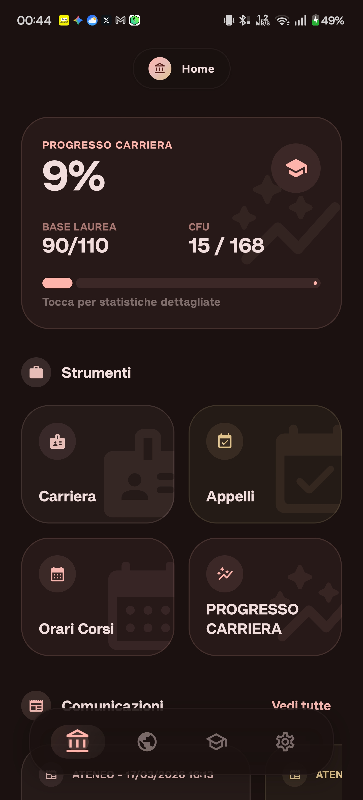
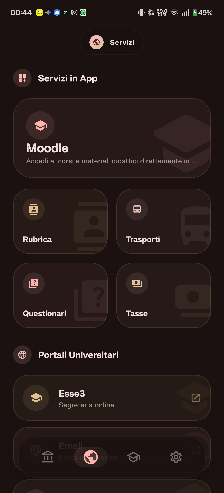
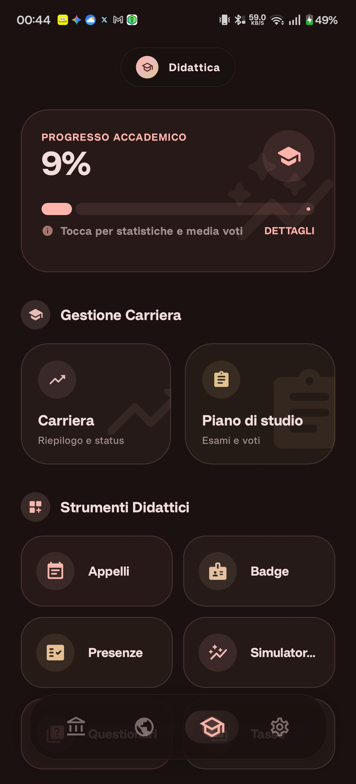
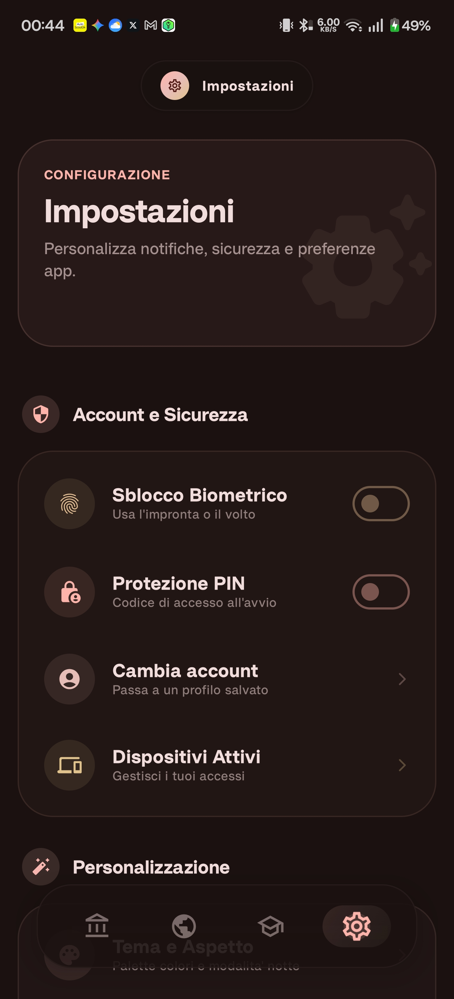
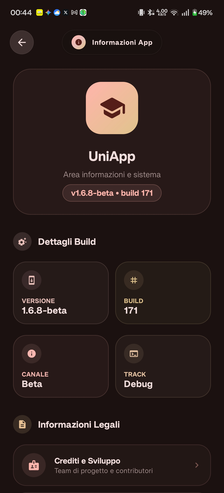
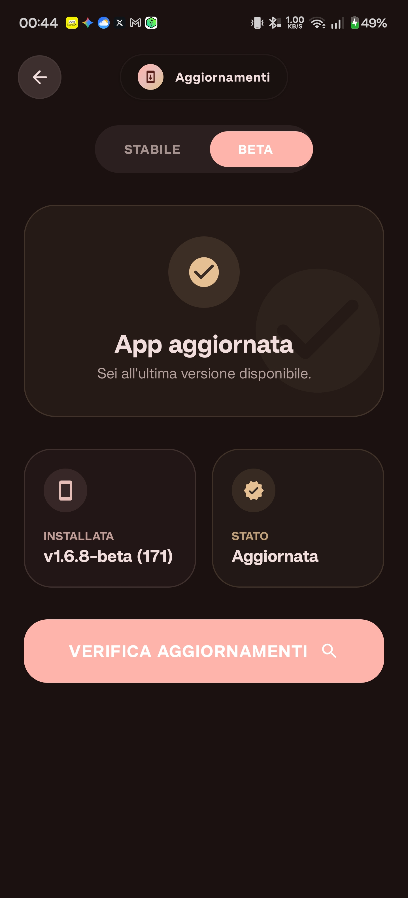
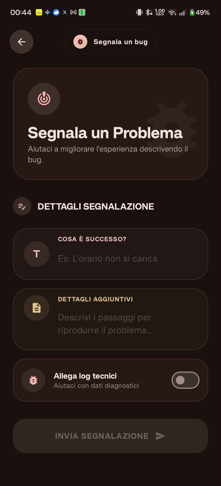
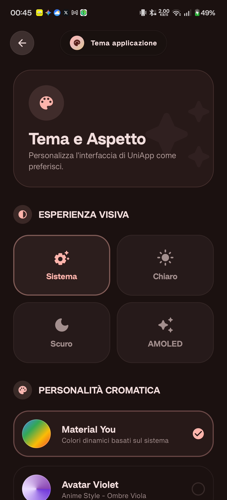
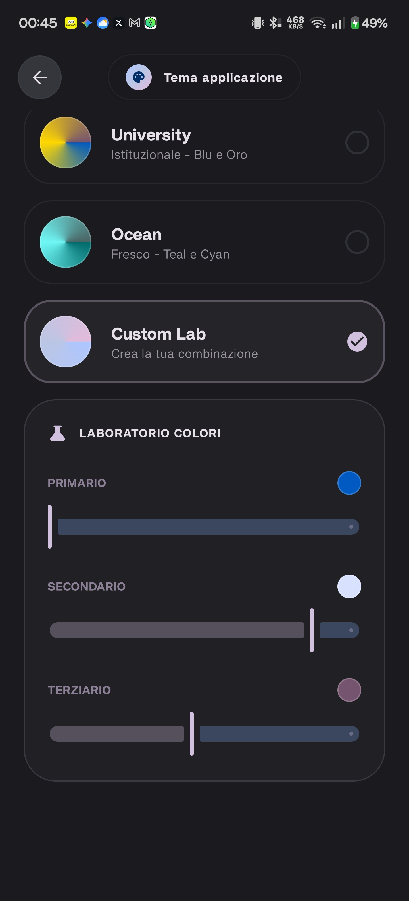

<p align="center">
  
</p>

<h1 align="center">UniApp Upstream</h1>


<p align="center">
  
</p>


<p align="center">
  Repository di distribuzione per il canale release Android di <strong>UniApp</strong>.
  Qui vengono pubblicati l'APK corrente, il manifest degli aggiornamenti usato dall'app e i metadati della release.
</p>

<p align="center">
  <a href="https://raw.githubusercontent.com/Anto426-Project/UniappUpstream/main/src/release/androidApp-release.apk"></a>
  <a href="https://github.com/Anto426-Project/UniappUpstream/raw/main/src/release/beta/androidApp-universal-release.apk"></a>
  <a href="./update.json"></a>
</p>


## Descrizione
Stanchi della vecchia app universitaria?
Scopri UniApp, l’app non ufficiale per gli studenti dell’Università degli Studi del Molise, sviluppata in autonomia da Anto426. Completamente riscritta in Kotlin nativo, utilizza le più recenti tecnologie Material 3 Design e Jetpack Compose per offrire un’esperienza moderna, fluida e intuitiva. Gestisci la tua carriera, consulta il libretto, prenota gli esami e accedi rapidamente alle informazioni più importanti, tutto in un’unica interfaccia veloce e curata.


## Security Scan
Quest'app e' stata scansionata per potenziali minacce.
- [Report Analisi VirusTotal](<https://www.virustotal.com/gui/file-analysis/YjJmYzg2OWI4Zjc3MzFiNmUyNTVjNjBkMmIxMjU4MDU6MTc3NTE2OTk3Mg==/detection>)

[](<https://www.virustotal.com/gui/file-analysis/YjJmYzg2OWI4Zjc3MzFiNmUyNTVjNjBkMmIxMjU4MDU6MTc3NTE2OTk3Mg==/detection>)


## Screenshot

<p align="center">
  
  
  
  
  
  
  
  
  
</p>


## Panoramica

Questo e' il repository di deploy delle build Android di UniApp.
E' pensato per restare semplice, stabile e leggibile anche da script:

- `src/release/stable/` contiene APK e metadati stabili
- `src/release/beta/` contiene APK e metadati beta
- `update.json` espone i manifest separati per canale sotto `channels`
- `README.md` riassume la release pubblica corrente

## Release Corrente

| Campo | Valore |
| --- | --- |
| App | UniApp |
| Repository | `Anto426-Project/UniappUpstream` |
| Versione corrente | `1.7.3-beta` |
| Canale release | `beta` |
| Version code | `181` |
| Pubblicata il | `2026-04-02` |
| Versione minima supportata | `1.7.3-beta` |
| Aggiornamento obbligatorio | `true` |
| App abilitata | `true` |
| Package name | `com.anto426.uniapp` |
| Min SDK | `29` |
| File APK | `src/release/beta/androidApp-universal-release.apk` |
| Dimensione APK | `51.4 MB` |

## Link Rapidi

- [Scarica APK corrente](https://github.com/Anto426-Project/UniappUpstream/raw/main/src/release/beta/androidApp-universal-release.apk)
- [Metadati del canale corrente](./src/release/beta/output-metadata.json)
- [Percorso APK del canale corrente](./src/release/beta/androidApp-universal-release.apk)
- [APK stabile](https://raw.githubusercontent.com/Anto426-Project/UniappUpstream/main/src/release/androidApp-release.apk)
- [APK beta](https://github.com/Anto426-Project/UniappUpstream/raw/main/src/release/beta/androidApp-universal-release.apk)
- [Apri il manifest aggiornamenti](./update.json)

## Note Di Rilascio

Changelog 03 Apr 2026:
- Aggiornata la Home
- Risolti numerosi bug
- Ottimizzata l’app
- Aggiunto modulo per gli orari dei pullman per le sedi principali
- Riabilitate le notifiche

## Struttura Repository

```text
assets/
  uniapp-icon.webp
  screenshots/
    ...
src/
  release/
    stable/
      ...
    beta/
      ...
update.json
README.md
```

## Feed Aggiornamenti

L'app legge `update.json` per capire se esiste una build piu' recente.
I campi principali sono:

- `channels.stable.release`
- `channels.beta.release`
- `latestVersion`
- `downloadUrl`
- `publishedAt`
- `buildCommit`

`downloadUrl` punta attualmente a:

`https://github.com/Anto426-Project/UniappUpstream/raw/main/src/release/beta/androidApp-universal-release.apk`

## Flusso Di Pubblicazione

Questo repository viene aggiornato automaticamente dal workflow GitHub Actions del repository principale di UniApp.
Ogni pubblicazione aggiorna:

1. l'APK sotto `src/release/stable/` oppure `src/release/beta/`
2. il relativo `output-metadata.json`
3. `update.json`
4. questo `README.md`

## Note

- Questo repository e' un endpoint di release, non il repository principale di sviluppo.
- I file pubblicati possono cambiare a ogni nuova release.
